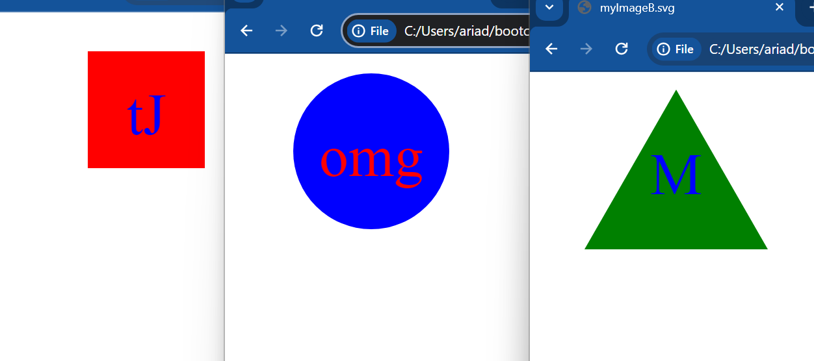

# SVG Logo Maker

## Description

This project builds an svg logo using data entered on the command-line. The svg logo will have up to three characters, be filled a color specified by user. The text entered will be enclosed in a shape: Circle, Triangle or Square. Inquirer used for prompt. Jest used for running unit tests.

Video Walkthrough of building logo:
https://watch.screencastify.com/v/b2cDQc0g1U94PYYUSlfw

Video of running unit tests:
https://watch.screencastify.com/v/7E9tQrbcv0TpN4Ao0v4i

## Installation

npm i

## Usage

Run node index.js 
The application will prompt the user for up to three characters (has a default if none entered). The user will then be prompted for the color of the text, which can be a color keyword or Hex#. Next, an option to choose between a circle, triangle or square. Lastly, a prompt for the shape color. Once all input has been entered, "Generated logo.svg" will then display on the command line.

Screenshots of logo examples generated:

## Credits

Sofia Villalpando

## License

MIT License
